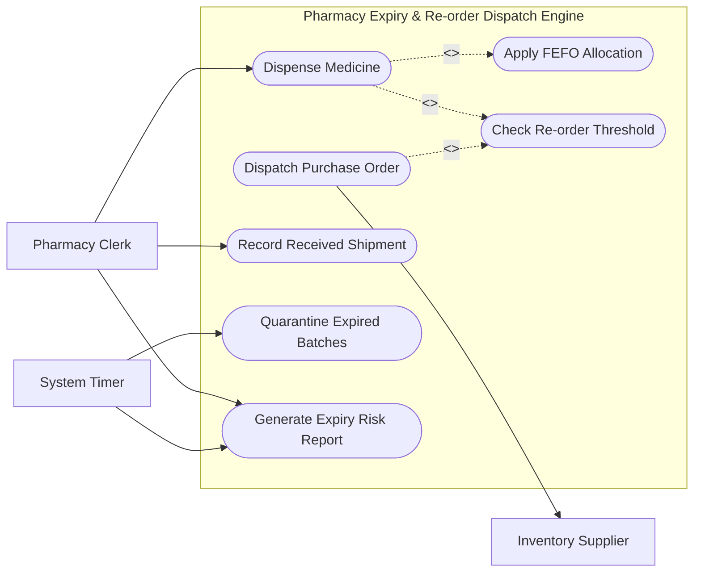

```mermaid
graph LR
    subgraph System ["Pharmacy Expiry & Re-order Dispatch Engine"]
        UC1(["Dispense Medicine"])
        UC2(["Apply FEFO Allocation"])
        UC3(["Check Re-order Threshold"])
        UC4(["Dispatch Purchase Order"])
        UC5(["Record Received Shipment"])
        UC6(["Quarantine Expired Batches"])
        UC7(["Generate Expiry Risk Report"])
    end

    Clerk["Pharmacy Clerk"] --> UC1
    Clerk --> UC5
    Clerk --> UC7

    UC1 -.->|<<include>>| UC2
    UC1 -.->|<<include>>| UC3
    UC4 -.->|<<extend>>| UC3

    UC4 --> Supplier["Inventory Supplier"]
    Timer["System Timer"] --> UC6
    Timer --> UC7
```
